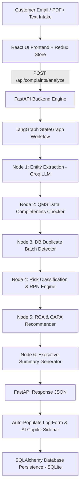

# AI-Powered Customer Complaint Management System (Pharma QMS)


-emerald)

An enterprise-grade, AI-powered Quality Management System (QMS) Customer Complaint Handling platform engineered for Pharmaceutical Manufacturing (Active Pharmaceutical Ingredients - API & Finished Dosage Forms - FDF). Compliant with FDA cGMP (21 CFR Part 211.198) and ICH Q9 Quality Risk Management guidelines.

---

## 🌟 Key Features & AI Capabilities

- **Automated QMS Entity Extraction**: LangGraph AI agent parses raw customer complaint emails, PDF documents, or text logs into structured pharma fields (`product_name`, `batch_number`, `defect_category`, `customer_name`, `storage_condition`).
- **QMS Data Completeness Checker**: Evaluates mandatory regulatory fields and outputs a real-time data completeness score ($0-100\%$) and missing field flags.
- **Duplicate Complaint & Pattern Detection**: Queries historical QMS database for matching batch numbers (`BAT-xxxx`) or product defect patterns, escalating risk to `HIGH - Potential Systemic Batch Issue`.
- **AI Risk Assessment & RPN Engine**: Calculates Risk Priority Number ($RPN = \text{Severity} \times \text{Probability} \times \text{Detectability}$), classifies Risk Level (`Critical`, `Major`, `Minor`), and flags mandatory **FDA 3-Day Field Alert Report (FAR)** reportable events.
- **Root Cause Analysis (RCA) & CAPA Recommendation**: Proposes 5-Why / Fishbone root cause hypotheses tailored to pharma manufacturing alongside actionable Corrective and Preventive Action (CAPA) plans with target departments.
- **Executive QMS Summary Generator**: Generates concise 3-sentence review board summaries.
- **Interactive QMS Dashboard**: Real-time KPI counter cards, API vs FDF product type filters, status dropdowns, search bar, and audit trail detail modals.

---

## 🛠️ Mandatory Technology Stack

- **Frontend**: React 18, Redux Toolkit (`@reduxjs/toolkit`, `react-redux`), Lucide React icons, Google Inter Font, Vanilla CSS design tokens.
- **Backend**: Python 3.10+, FastAPI, Pydantic v2, SQLAlchemy ORM, SQLite (`pharma_qms.db`).
- **AI Agent Framework**: **LangGraph** (`langgraph`, `langchain-groq`).
- **LLM Provider**: **Groq API** (`llama-3.3-70b-versatile` & `llama-3.1-8b-instant`).

---

## 📐 System Architecture Workflow



---

## 🚀 Local Quickstart Guide

### 1. Prerequisites
- Python 3.10+
- Node.js 18+
- Groq API Key (Create free key at [console.groq.com](https://console.groq.com))

### 2. Backend Setup
```bash
cd backend
python -m venv venv
# On Windows:
.\venv\Scripts\activate
# On macOS/Linux:
# source venv/bin/activate

pip install -r requirements.txt
```

Create `.env` file in `backend/`:
```env
GROQ_API_KEY=gsk_your_groq_api_key_here
DATABASE_URL=sqlite:///./pharma_qms.db
```

Run FastAPI Backend Server:
```bash
uvicorn app.main:app --reload --port 8000
```

### 3. Frontend Setup
```bash
cd frontend
npm install
npm run dev
```
Open [http://localhost:3000](http://localhost:3000) in your browser.

---

## 🧪 Verification & Automated Testing

To run the automated REST API integration test:
```bash
python backend/test_endpoints.py
```

To run the LangGraph Multi-Node AI Agent workflow test:
```bash
python backend/test_ai_agent.py
```
